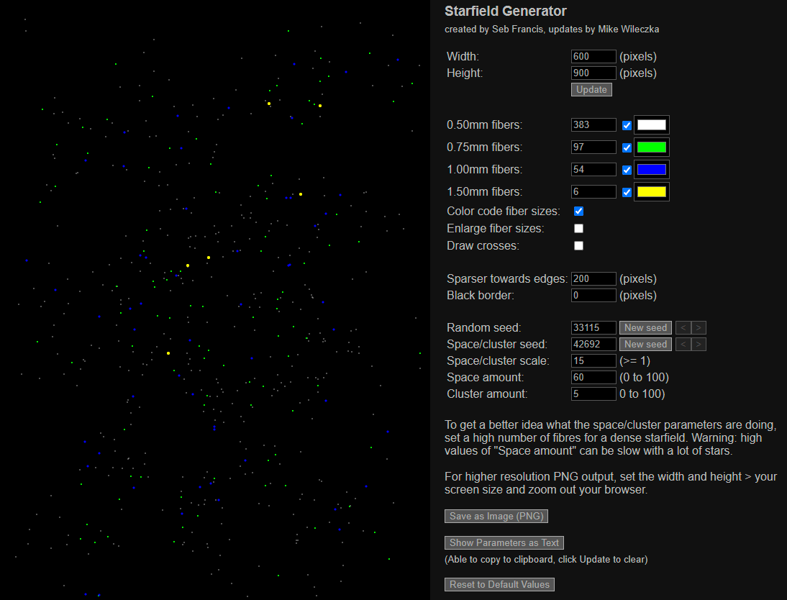

# Fiber Starfield Generator

Tool for generating fiber optic starfield patterns.

Originally created by Seb Francis for starceiling.co.uk (https://www.starceiling.co.uk/large.html)

Updates and new features being maintained here.

- Custom width and height
- Up to 4 fiber sizes
- Drawing options
    - Draw dots close to scale
    - Draw larger dots with more size difference (easier to see)
    - Draw crosses (easier for marking)
    - All white or custom colors
- Save as PNG image

